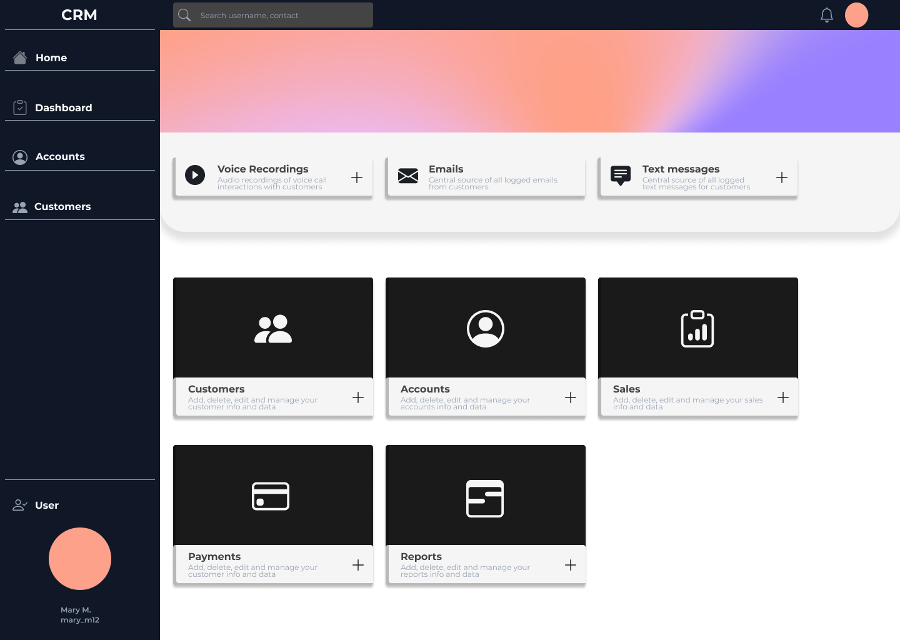

# Customer Care CRM &middot;
[](https://github.com/apexDev37/Customer-Care-CRM/blob/master/README.md)
[](https://snyk.io/test/github/apexDev37/Customer-Care-CRM?targetFile=pom.xml)
[](http://makeapullrequest.com)
[](https://github.com/apexDev37/Customer-Care-CRM/commits/)
[](https://maven.apache.org/download.cgi)
[](https://jdk.java.net/19/)
> Giving users a better 360 degree view of their customers with custom tools and features 

Customer Care CRM is a web application that provides rich tools and features to enable customer care representatives and
personnel to better interact and maintain customer relations. These tools include audio voice recording and logging of 
customer emails and text messages to the central source and interface.

**Goal**: To empower organizations to make informed and tactical decisions based on the analysis and assessment of 
previous customer relations by recording voice call interactions with customers and persisting them for future access.

## Installing / Getting started

This is a quick introduction of the minimal setup you need to get the project running locally. Customer Care CRM is a 
[Spring Boot](https://spring.io/guides/gs/spring-boot) application built using [Maven](https://spring.io/guides/gs/maven/). 
Follow the commands to `clone` the repository, `build` a jar, and run it from the terminal.
> Note: `Java 17` or newer is required

```shell
  // clone the repository
  https://github.com/apexDev37/Customer-Care-CRM.git
  cd Customer-Care-CRM
  
  // build and run jar file
  ./mvnw package
  java -jar target/*.jar  
```

Once the application is running you can access it on the default port: http://localhost:8080/


## Developing

### Built with
| Purpose    | Name        | Version | Description                                                                 |
|------------|-------------|---------|-----------------------------------------------------------------------------|
| Packaging  | Maven       | 4.0.2   | Build system                                                                |
| Language   | Java        | 17      | High-level programming language                                             |
| Framework  | Spring Boot | 3.0.2   | Framework to create stand-alone, production-grade Spring based applications |

A list of project dependencies can be viewed in the [pom.xml](pom.xml) in the project's root directory.

## Licensing

For a repository to indeed be open source, you'll need to _license_ it so that others are free to use, change, and 
distribute the software. This project ensures this using the [MIT license](https://en.wikipedia.org/wiki/MIT_License).
Find the full original text version of the license [here](https://choosealicense.com/licenses/mit/#). 
Follow the instructions to apply the right to your repository.
